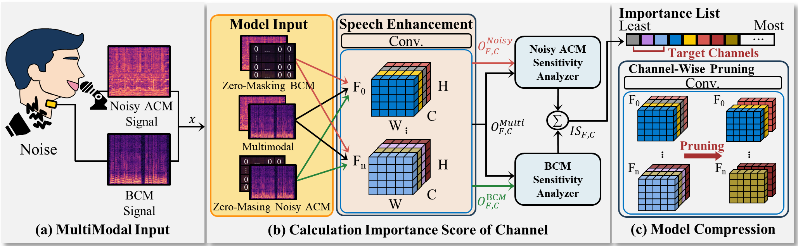
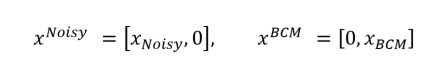
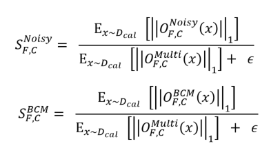
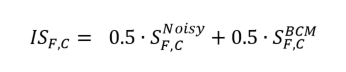

# CCAP

**Cross-Modal Consistency–Aware Structured Pruning for Efficient Speech Enhancement with Air- and Bone-Conduction Microphones**

This repository provides the **channel scoring utilities** of **CCAP** (Cross-Modal Consistency–Aware Structured Pruning).
Specifically, it implements:
- **Modality-wise zero-masking** (Noisy-ACM-only / BCM-only) at the input,
- **Hook-based activation extraction** at target layers,
- **CCAP sensitivities** and **importance scores** defined in the paper.

This repo focuses on **scoring only** (activation collection + sensitivity/importance computation).  

  

---

## Abstract

Multimodal speech enhancement (MMSE) improves speech intelligibility in noisy environments by leveraging complementary strengths of various signals.
However, complex MMSE models and substantial computational demands pose challenges for implementation on wearable devices such as headsets and earbuds. 
This has driven the need for model compression; however, prior approaches are often not tailored to multimodal fusion and may fail to preserve 
fusion-critical information under practical noise and cross-modal mismatch. To address these limitations, we introduce cross-modal consistency-aware structured pruning (CCAP). 
CCAP estimates channel importance using modality-specific zero masking and ranks channels by response consistency with the multimodal input to preserve modality-shared information. 
Experiments on a paired air–bone dataset show that CCAP improves PESQ and STOI across multiple architectures over prior pruning baselines and reduces inference latency at equivalent pruning ratios, supporting embedded deployment.

---

## Method Overview (CCAP Scoring)

CCAP evaluates channel importance by comparing channel responses under **modality-wise zero-masking** against a **multimodal reference**.

### 1) Paired input and three masking conditions

  

### 2) Channel response statistic

For a target layer (or filter) $F$ and output channel $C$, let $O_{F,C}(\cdot)$ denote the channel activation.  
CCAP summarizes activation magnitude using the L1 norm and computes dataset-level expectations over a calibration set $D_{\mathrm{cal}}$.

  

### 3) Normalized sensitivities and final importance

CCAP computes normalized sensitivities by measuring how well each channel response is preserved under each masked condition relative to the multimodal reference.
The final importance score is obtained by a symmetric aggregation of the two sensitivities:

  

A high $IS_{F,C}$ indicates that a channel responds **consistently** under both zero-masked conditions relative to the multimodal reference, suggesting **modality-shared / fusion-relevant** behavior.

---

## Implementation Notes (Paper-faithful details)

- **Exact statistic used:** for each sample $x$, we compute channel-wise $|O_{F,C}(x)|_1$ by summing absolute activations over all non-channel dimensions.

- **Unbiased expectation over samples:** accumulation is performed by summing $|O_{F,C}(x)|_1$ over **all samples** and dividing by the **total number of samples**. This ensures correctness even when the last batch has a different size.

- **Zero-masking location:** modality-wise zero-masking is applied **at the input** (Noisy-only / BCM-only), matching the paper definition.

- **Numerical stability:** $\epsilon$ is included only to avoid division-by-zero when $E[|O^{Multi}_{F,C}(x)|_1]$ is very small; it does not change the intended scoring behavior.

---

## Citation

TBD.
